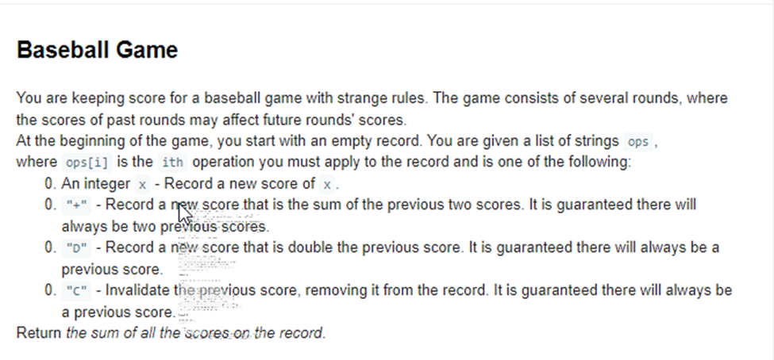

# Solve the Turing Baseball Game Challenge

## Problem

Solve the below problem in Go

## Running

Run using the following command: `go run .`
Run the tests using `go test -v .`

## Authors

[Munene Ndereba](https://github.com/munenendereba)

## License

This project is licensed under the MIT License.
